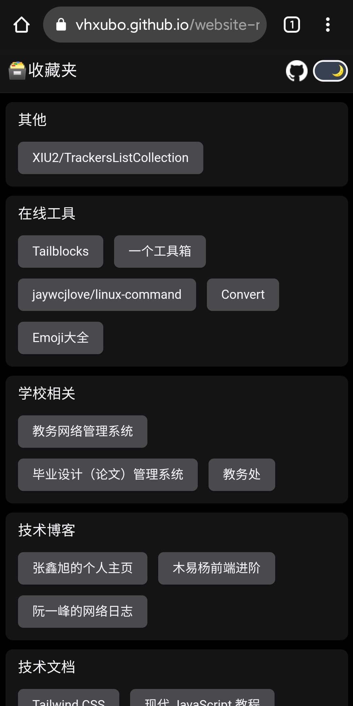

# website-navigation

> 构建属于自己的网址导航

见过很多类型的导航，总觉得数据的定义与修改实在是过于麻烦，或者是需要后端的支持
该项目通过结合GitHub Action和Issues，将整个导航都移植到了GitHub上面

项目后端地址：[vhxubo/websites](https://github.com/vhxubo/websites)


|  屏幕   |                    日间                     |                   夜间                    |
| :-----: | :-----------------------------------------: | :---------------------------------------: |
| >=768px |        |        |
| <768px  |  |  |

## 技术栈

- Vue3
- TypeScript
- Vite
- tailwindcss

## 功能

- 可配合[vhxubo/websites](https://github.com/vhxubo/websites)使用GitHub Issues作为后端
- 黑暗模式
- 一键返回顶部
- 响应式设计

## 如何使用

1. fork [vhxubo/website-navigation](https://github.com/vhxubo/website-navigation)和[vhxubo/websites](https://github.com/vhxubo/websites)
2. 配置[vhxubo/websites](https://github.com/vhxubo/websites)，即新建符合要求的issues
3. 修改`App.vue`下的`repository`变量 `const repository = '[username]/websites'`
4. 配置GitHub Page

如果你在`[username].github.io`下部署，需要将[build.yml](github\workflows\build.yml)中的以下代码删除，否则不能正常显示页面

```yml
- name: Fix path
  run: |
    sed -i 's/\/assets\//\/website-navigation\/assets\//g' dist/index.html
    sed -i 's/\/favicon.ico/\/website-navigation\/favicon.ico/g' dist/index.html
```

## TODO

- 优化一键返回顶部动画
- 优化黑暗模式

## 数据定义

```json
{
  "author": "vhxubo",
  "github": "https://github.com/vhxubo/websites",
  "updateTime": "2021-04-02T10:01:30+08:00",
  "list": [
    {
      "label": "学校相关",
      "items": [
        {
          "name": "教务网络管理系统",
          "url": "https://www.lit.edu.cn/jwc/jwwlglxt.htm",
          "description": "洛阳理工学院教务网络管理系统登录，可分别选择相应入口"
        },
        {
          "name": "毕业设计（论文）管理系统",
          "url": "http://lit.co.cnki.net",
          "description": "学生账号用户名为学号，密码为身份证号后八位"
        },
        {
          "name": "教务处",
          "url": "https://www.lit.edu.cn/jwc/",
          "description": "洛理教务在线"
        }
      ]
    },
    {
      "label": "文化娱乐",
      "items": [
        {
          "name": "YouTube",
          "url": "https://www.youtube.com/",
          "description": "在 YouTube 上畅享您喜爱的视频和音乐，上传原创内容并与亲朋好友和全世界观众分享您的视频。"
        },
        {
          "name": "哔哩哔哩",
          "url": "https://www.bilibili.com/",
          "description": "哔哩哔哩 (゜-゜)つロ 干杯~-bilibili"
        }
      ]
    },
    {
      "label": "编程相关",
      "items": [
        {
          "name": "力扣",
          "url": "https://leetcode-cn.com/problemset/all/",
          "description": "力扣 (LeetCode) 全球极客挚爱的技术成长平台"
        },
        {
          "name": "labuladong的算法小抄",
          "url": "https://labuladong.gitbook.io/algo/",
          "description": ""
        },
        {
          "name": "GitHub",
          "url": "https://github.com/",
          "description": "交友平台"
        }
      ]
    }
  ]
}
```
